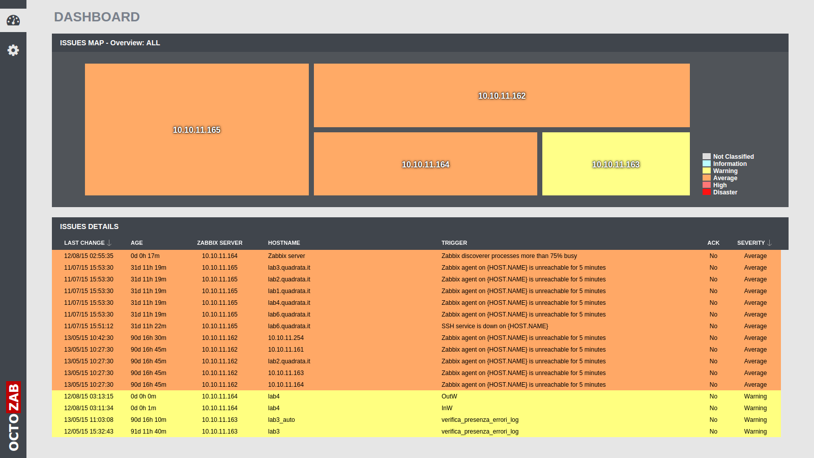

# OctoZab



This application is a backend/frontend system to remotely control multiple Zabbix servers (http://www.zabbix.com/).

Demo: [here](http://demo.quadrata.it/octozab/)


## Features

- Issues list sorted by Severity -> Last Change
- Issues treemap overview, with drilldown per server
- Dynamic filtering on issues list through interaction with treemap objects
- Redirect to issue details from issues list


## Dependencies

- [NodeJS](http://nodejs.org/)	tested >= 0.12.6
- [Redis](http://redis.io/)		tested >= 3.0.2


## How does it work

Backend is made by a NodeJS server, that operates in order to authenticate Zabbix servers and communicate with APIs they expose. Collected data is then stored on Redis DB, that caches it. Redis keys are monitored by the server in order to send changes back to client frontends whenever they occur. Clients are connected to server through WebSockets.

## Docker Container

An easy and fast way to test the application is using our Docker container. Install [docker](https://docs.docker.com/) on your machine, pull the image and run it:

```shell
docker pull quadrata/octozab
docker run -it -d -p $frontendHostPort:80 -p $backendHostPort:8080 --name="octoZab" quadrata/octozab
```

where $frontendHostPort and $backendHostPort are ports on your host where you desire that frontend and backend respectively should run. Now you have to configure a bit the container. Attach to it, start Apache WebServer and Redis services, and add Zabbix servers to monitor:

```shell
service httpd start
service octozab-redis start
```

```shell
docker attach octoZab
redis-cli sadd octo-zab:servers:name.set serverDomain1 serverDomain2 ...
```

Whenever you want to remove some of the servers, replace `sadd` with `sdel` and specify list of servers to remove (after having modified servers list to monitor, restart `octozab-node` service mentioned below). At the moment backend connects to Zabbix servers through default administration user `Admin` and psw `zabbix`, so be sure they exist on them.

Modify frontend `"/var/www/html/octozab/config.js"` with your host url and host backend port you defined above at container run.

Finally, start the backend server:

```shell
service octozab-node start
```

And then detach from container with Ctrl+P-Ctrl+Q.


That's it! Now you should be able to connect to application browsing at `http://yourHostUrl:yourHostFrontendPort/octozab` (if you mapped container port 80, webserver one, with port 80 on your host, you can omit the `:yourHostFrontendPort` url part).


## Installation

In order to test the application, first step is to install dependencies listed above. Once `node`, `npm`, `redis-server` and `redis-cli` executables are installed on server, you can start deploying both backend and frontend by cloning repository on webserver root.

If you prefer to deploy backend and frontend on different machines, copy only `"backend"` folder on backend machine, and the rest of the repository on frontend machine. Then modify in the file `"config.js"` the `backendUrl` parameter with backend domain name. Be sure port `8080` is exposed to frontend from backend.

List of Zabbix servers to monitor is retrieved from Redis DB, therefore it's necessary to set right key on DB as follows:

```shell
redis-cli sadd octo-zab:servers:name.set serverDomain1 serverDomain2 ...
```

Whenever you want to remove some of the servers, replace `sadd` with `sdel` and specify list of servers to remove (after having modified servers list to monitor, restart `octozab-node` service mentioned below). At the moment backend connects to Zabbix servers through default administration user `Admin` and psw `zabbix`, so be sure they exist on them.

Install NodeJS module dependencies. Move from command-line to backend folder and run following command:

```shell
npm install
```

Frontend is based on ExtJS framework. In order to make the source code work, you have first to install SenchaCmd tool version [5.0.0.160](http://cdn.sencha.com/cmd/5.0.0.160/SenchaCmd-5.0.0.160-linux-x64.run.zip) (link is for Linux 64bit version). Check SenchaCmd dependencies [here](http://docs.sencha.com/cmd/5.x/intro_to_cmd.html#System_Setup) (Java >=1.7, Ruby >=2.0.0, Compass).
Then from command-line move to frontend folder, and give the following commands:

```shell
sencha app upgrade
sencha app build
```

Now run backend services. The simplest way is to open separate shells for Redis DB:

```shell
redis-server $backend/redis.conf
```

and NodeJS server:

```shell
node $backend/server.js
```

where `$backend` is the path to `"backend"` folder deployed before.


## Usage

To see OctoZab in action, it's enough to connect to frontend, based on where you deployed frontend source code. If later you want to have a production release of it, use the SenchaCmd tool. Move from command-line to frontend folder, and run:

```shell
sencha app build
```

You will find the production release under `"$frontend/build/production/OctoZab"` (`$frontend` is the path where frontend is deployed).


## Roadmap

- Allow to specify credentials for each Zabbix server
- Replace treemap overview with some other way/chart that gives a better understanding of each Zabbix server healthy (give us your feedback on this)
- Many more Zabbix features based on audience feedback


## License

GPL v2